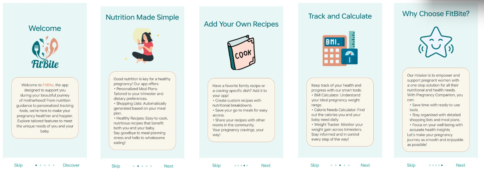
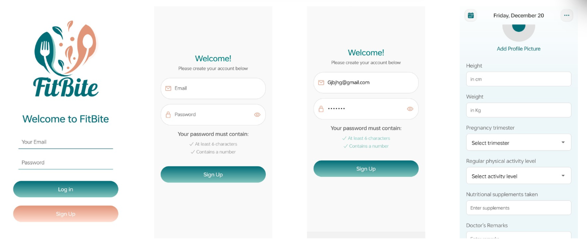
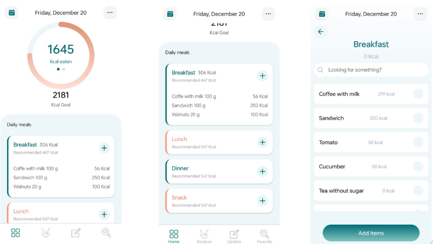
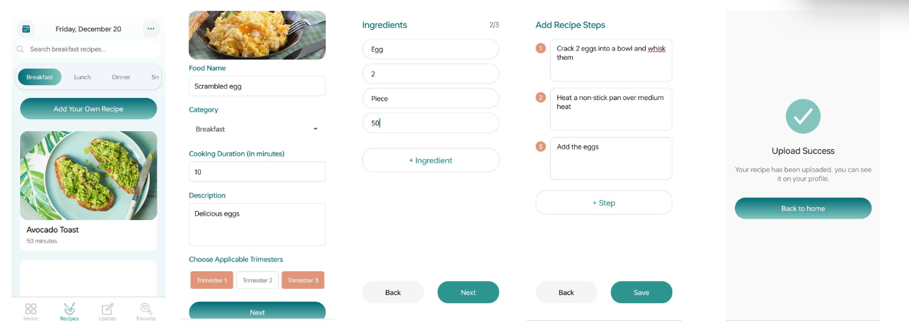
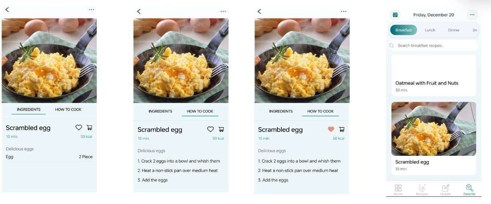
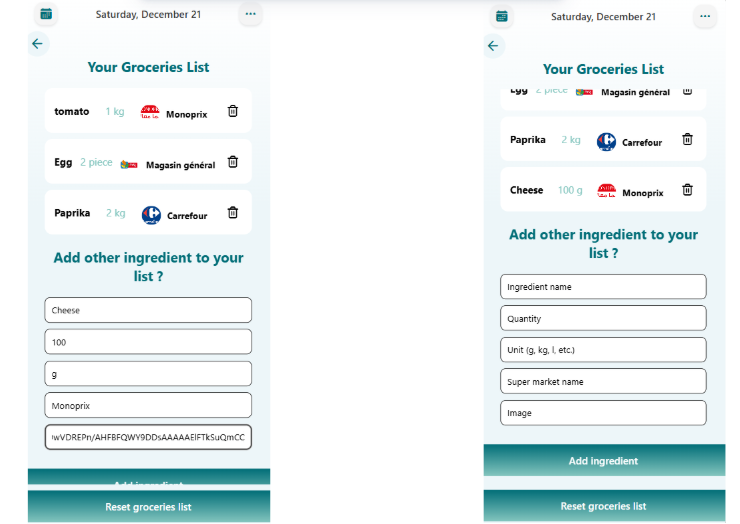
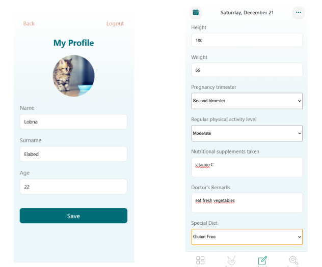
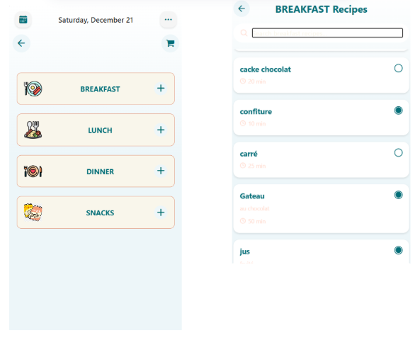

# FitBite - Application Mobile de Gestion de Recettes

## 📱 Description

**FitBite** est une **application mobile native multi-plateforme** (iOS & Android) complète développée avec:
- **Frontend**: React Native avec Expo (multiplateforme)
- **Backend**: Node.js avec Express.js (API RESTful)

Cette application permet aux utilisateurs de:
- 👨‍🍳 Découvrir et gérer des recettes
- ❤️ Ajouter des recettes à leurs favoris
- 🛒 Créer et gérer une liste de courses
- 🍽️ Planifier des repas
- 👤 Gérer leur profil utilisateur
- 🔐 S'authentifier de manière sécurisée

## 📱 Aperçu de l'Application

<table>
  <tr>
    <td align="center">
      
      <br><em>écran d'accueil</em>
    </td>
    <td align="center">
      
      <br><em>Inscription & Connexion</em>
    </td>
    <td align="center">
      
      <br><em>Accueil & Calories</em>
    </td>
  </tr>
  <tr>
    <td align="center">
      
      <br><em>Bibliothèque de recettes</em>
    </td>
    <td align="center">
      
      <br><em>Recettes favorites</em>
    </td>
    <td align="center">
      
      <br><em>Liste de courses</em>
    </td>
  </tr>
  <tr>
    <td align="center" colspan="2">
      
      <br><em>Profil & Formulaire dynamique</em>
    </td>
    <td align="center">
      
      <br><em>Planification des repas</em>
    </td>
  </tr>
</table>


**Stack technique complet**: React Native (Expo) + Node.js/Express + MongoDB

## 🏗️ Architecture du Projet

Le projet suit une architecture **client-serveur** avec séparation claire entre:

```
FitBite/
├── BACKEND/           # API Node.js/Express
├── FRONTEND/          # Application React Native
└── assets/            # Ressources partagées
```

## 🔧 Stack Technologique

### Backend
- **Runtime**: Node.js
- **Framework**: Express.js 4.21
- **Base de données**: MongoDB (Mongoose 8.8)
- **Authentification**: JWT (jsonwebtoken 9.0)
- **Sécurité**: bcryptjs, CORS, dotenv
- **Documentation API**: Swagger/OpenAPI
- **Email**: Nodemailer 6.9

### Frontend
- **Framework**: React Native 0.76
- **Build Tool**: Expo (~52.0)
- **Navigation**: React Navigation 7.x
  - Bottom Tabs
  - Native Stack
  - Stack Navigation
- **HTTP Client**: Axios 1.7
- **State Management**: Context API (UserContext)
- **Storage Local**: AsyncStorage
- **UI Components**: React Native Elements, Lucide Icons
- **Gradient UI**: expo-linear-gradient
- **Date/Time**: @react-native-community/datetimepicker
- **Image Handling**: expo-image-picker, react-native-image-picker

## 📁 Structure des Dossiers

### BACKEND/
```
BACKEND/
├── server.js                    # Fichier principal du serveur
├── package.json                 # Dépendances et scripts
├── config/
│   └── db.js                   # Configuration MongoDB
├── models/                      # Schémas de données
│   ├── User.js                 # Modèle utilisateur
│   ├── recettes.js             # Modèle recettes
│   ├── Meal.js                 # Modèle repas/meals
│   ├── favoris.js              # Modèle favoris
│   ├── listeCourses.js         # Modèle liste de courses
│   ├── ingredients.js          # Modèle ingrédients
│   ├── supermarches.js         # Modèle supermarchés
│   └── formulaireDynamique.js  # Modèle formulaires dynamiques
├── controllers/                 # Logique métier
│   ├── utilisateursController.js
│   ├── recettesController.js
│   ├── MealController.js
│   ├── favorisController.js
│   ├── listeCoursesController.js
│   ├── ingredientsController.js
│   ├── supermarchesController.js
│   └── formulaireDynamiqueController.js
├── routes/                      # Points de terminaison API
│   ├── authRoutes.js
│   ├── utilisateursRoutes.js
│   ├── recettesRoutes.js
│   ├── MealRoutes.js
│   ├── favorisRoutes.js
│   ├── listeCoursesRoutes.js
│   ├── ingredientsRoutes.js
│   ├── supermarchesRoutes.js
│   └── formulaireDynamiqueRoutes.js
└── middlewares/
    └── authMiddleware.js       # Middleware d'authentification JWT
```

### FRONTEND/
```
FRONTEND/
├── App.js                       # Composant racine
├── index.js                     # Point d'entrée
├── package.json
├── metro.config.js              # Configuration Expo Metro
├── navigation/                  # Navigation de l'application
│   ├── Navigation.js            # Configuration principale
│   ├── AuthStack.js             # Navigation authentification
│   ├── MainStack.js             # Navigation écrans principaux
│   ├── OnboardingStack.js       # Navigation onboarding
│   └── addfoodstack.js          # Navigation ajout de nourriture
├── screens/                     # Écrans de l'application
│   ├── Auth/
│   │   ├── LoginScreen.js
│   │   ├── SignupFormScreen.js
│   │   ├── SignUpScreen.js
│   │   └── VerifyScreen.js
│   ├── Main/
│   │   ├── HomeScreen.js
│   │   ├── FavoriteScreen.js
│   │   ├── GroceriesListScreen.js
│   │   ├── addReceipe.js
│   │   ├── ingredients.js
│   │   └── Header.js
│   ├── addfood/                 # Écrans ajout de nourriture (multi-étapes)
│   │   ├── addfood1.js
│   │   ├── addfood2.js
│   │   ├── addfood3.js
│   │   ├── addfood4.js
│   │   ├── addfood5.js
│   │   └── ParentComponent.js
│   └── onboarding/              # Écrans onboarding
├── components/                  # Composants réutilisables
│   ├── Button.js
│   ├── Button2.js
│   ├── Card.js
│   └── Input.js
├── services/                    # Services et contexte
│   ├── apiService.js            # Appels API
│   └── Usercontext.js           # Context API pour utilisateur
├── styles/                      # Styles et thèmes
│   ├── colors.js
│   └── globalStyles.js
├── utils/                       # Utilitaires
│   ├── api.js
│   └── validations.js
├── assets/
│   └── images/                  # Ressources images
├── android/                     # Configuration Android
│   └── build/
└── ios/                         # Configuration iOS
    └── fitbite.xcodeproj/
```

## 🚀 Démarrage Rapide

### Prérequis
- Node.js (v16+)
- npm ou yarn
- Expo CLI: `npm install -g expo-cli`

### Installation Backend

```bash
cd BACKEND
npm install
# Configurer le fichier .env avec les variables d'environnement
npm start
```

### Installation Frontend

```bash
cd FRONTEND
npm install
# Ou pour une installation rapide
expo install

# Démarrage
npm start              # Expo dev server
npm run android        # Construire pour Android
npm run ios            # Construire pour iOS
npm run web            # Lancer sur web
```

## 📡 Configuration API

Le backend expose une API RESTful sur le port **5000** avec les points de terminaison suivants:

### Authentification
- `POST /api/auth/inscrire` - Inscription utilisateur
- `POST /api/auth/login` - Connexion utilisateur
- `POST /api/auth/verify` - Vérification du compte

### Recettes
- `GET /api/recettes` - Lister toutes les recettes
- `POST /api/recettes` - Créer une recette
- `GET /api/recettes/:id` - Détail d'une recette
- `PUT /api/recettes/:id` - Modifier une recette
- `DELETE /api/recettes/:id` - Supprimer une recette

### Favoris
- `GET /api/favoris` - Lister les favoris
- `POST /api/favoris` - Ajouter aux favoris
- `DELETE /api/favoris/:id` - Supprimer des favoris

### Repas (Meals)
- `GET /api/meals` - Lister les repas
- `POST /api/meals` - Créer un repas
- `GET /api/meals/:id` - Détail d'un repas
- `PUT /api/meals/:id` - Modifier un repas
- `DELETE /api/meals/:id` - Supprimer un repas

### Liste de Courses
- `GET /api/listeCourses` - Lister les courses
- `POST /api/listeCourses` - Créer une liste
- `PUT /api/listeCourses/:id` - Modifier une liste
- `DELETE /api/listeCourses/:id` - Supprimer une liste

### Ingrédients
- `GET /api/ingredients` - Lister les ingrédients
- `POST /api/ingredients` - Ajouter un ingrédient
- `GET /api/ingredients/:id` - Détail d'un ingrédient
- `PUT /api/ingredients/:id` - Modifier un ingrédient
- `DELETE /api/ingredients/:id` - Supprimer un ingrédient

### Supermarchés
- `GET /api/supermarches` - Lister les supermarchés
- `POST /api/supermarches` - Ajouter un supermarché
- `GET /api/supermarches/:id` - Détail d'un supermarché
- `PUT /api/supermarches/:id` - Modifier un supermarché
- `DELETE /api/supermarches/:id` - Supprimer un supermarché

### Utilisateurs
- `GET /api/utilisateurs/:id` - Profil utilisateur
- `PUT /api/utilisateurs/:id` - Mettre à jour le profil
- `DELETE /api/utilisateurs/:id` - Supprimer le compte

### Formulaires Dynamiques
- `GET /api/formulaireDynamique` - Lister les formulaires
- `POST /api/formulaireDynamique` - Créer un formulaire
- `GET /api/formulaireDynamique/:id` - Détail d'un formulaire
- `PUT /api/formulaireDynamique/:id` - Modifier un formulaire
- `DELETE /api/formulaireDynamique/:id` - Supprimer un formulaire

## 🔐 Authentification

L'application utilise **JWT (JSON Web Tokens)** pour l'authentification:

1. L'utilisateur s'inscrit ou se connecte
2. Le serveur retourne un token JWT
3. Le token est stocké localement avec AsyncStorage
4. Les requêtes API incluent le token dans le header `Authorization: Bearer <token>`
5. Le middleware `authMiddleware.js` valide le token côté serveur

## 🎨 Interface Utilisateur

### Navigation Principal
- **Onboarding**: Écran initial pour les nouveaux utilisateurs
- **Authentification**: Écrans de connexion et inscription
- **Accueil**: Affichage des recettes disponibles
- **Favoris**: Recettes sauvegardées
- **Liste de Courses**: Gestion des articles à acheter
- **Ajouter Recette**: Formulaire multi-étapes pour ajouter une nouvelle recette
- **Profil**: Gestion du compte utilisateur

### Composants Réutilisables
- `Button.js` - Bouton personnalisé
- `Button2.js` - Variante de bouton
- `Card.js` - Composant carte
- `Input.js` - Champ d'entrée

## 📦 Gestion d'État

L'application utilise **React Context API** pour gérer l'état global:

- **UserContext** (`services/Usercontext.js`) - Gère les informations utilisateur authentifié

## 💾 Stockage Local

- **AsyncStorage** - Stockage de:
  - Flag première utilisation (`hasLaunched`)
  - Données utilisateur
  - Préférences locales

## 🔧 Variables d'Environnement

### Backend (.env)
```
PORT=5000
MONGODB_URI=mongodb://...
JWT_SECRET=votre_secret_jwt
SMTP_SERVICE=gmail
SMTP_USER=email@gmail.com
SMTP_PASS=mot_de_passe_app
NODE_ENV=development
```

### Frontend
- URL API: `http://192.168.56.1:5000/api`

## 📊 Modèles de Données

### User
- Email, motDePasse, dateInscription, profil

### Recettes
- Nom, description, ingrédients, instructions, temps, difficulté

### Meals (Repas)
- Titre, date, recettes associées

### Favoris
- Référence utilisateur, référence recette

### ListeCourses
- Utilisateur, articles, statut

### Ingredients
- Nom, unité, catégorie

### Supermarches
- Nom, adresse, localisation

### FormulaireDynamique
- Questions, réponses, type


## 📖 Documentation API

La documentation Swagger est disponible au endpoint `/api-docs` du serveur backend.


